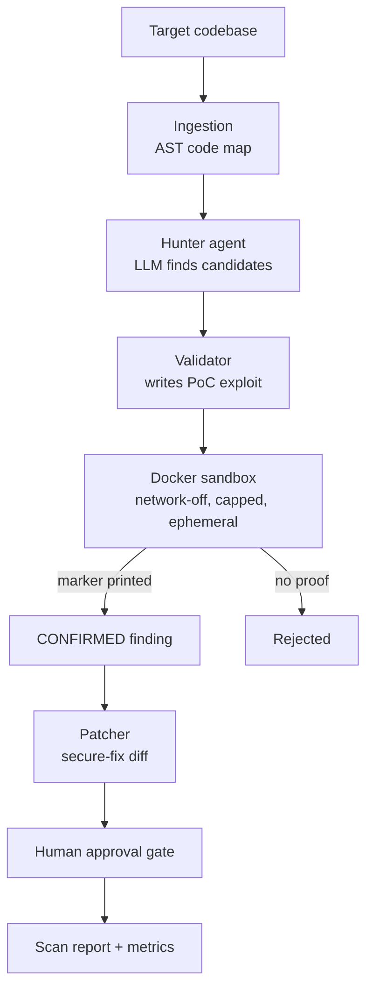

# Sentinel — Autonomous AppSec Agent

Sentinel is an AI agent that **finds, proves, and fixes** security vulnerabilities in source code. Unlike a typical AI scanner that just *claims* bugs, Sentinel **proves** each one by generating a proof-of-concept exploit and running it inside a locked-down sandbox — so what it reports is what's actually exploitable.

Inspired by the cyber-reasoning systems from DARPA's AI Cyber Challenge (2025), scoped as a single-developer build.

---

## Why it's different

Most LLM-based scanners produce a list of *claims*, many of which are hallucinated or wrong. Sentinel adds a **validation loop**: every candidate finding must be demonstrated by an executed exploit before it's reported. A claim that can't be proven is discarded. The result is a scanner whose false-positive rate is driven toward zero by construction.

---

## Architecture



The model layer is **provider-agnostic** (via LiteLLM): the same code runs on a local Ollama model, Anthropic Claude, or OpenAI — switched with one line in `.env`.

---

## Results

Measured by a reproducible evaluation harness against labeled ground truth:

| Target | True Pos. | False Pos. | False Neg. |
|---|---|---|---|
| `vulnerable_app` (3 planted bugs) | 3 | 0 | 0 |
| `safe_app` (clean control) | 0 | 0 | 0 |

**Precision 100% · Recall 100% · F1 1.00** on the current 2-target benchmark.

> Note: this is a small, hand-labeled starter benchmark — the value is the *methodology* (every change to the agent is now measurable), not the headline number. Expanding the benchmark with real-world CVEs is the top roadmap item.

---

## Quickstart

**Prerequisites:** Python 3.12, Docker, and either [Ollama](https://ollama.com) (free, local) or an Anthropic/OpenAI API key.

```bash
# 1. Set up the environment
python3 -m venv .venv
source .venv/bin/activate
pip install -r requirements.txt

# 2. Choose a model (local example)
ollama pull qwen2.5-coder:7b
echo "SENTINEL_MODEL=ollama/qwen2.5-coder:7b" > .env

# 3. Scan a target (find -> prove -> propose fixes, with approval)
python scan.py targets/vulnerable_app

# 4. Measure accuracy against the labeled benchmark
python evaluate.py
```

---

## How it works

| Stage | Module | What it does |
|---|---|---|
| Model layer | `sentinel/llm.py` | Provider-agnostic LLM client (Adapter pattern) |
| Ingestion | `sentinel/ingest.py` | Builds an AST code map of the target |
| Tools | `sentinel/tools.py` | Read-only, path-scoped investigation tools |
| Hunter | `sentinel/hunter.py` | LLM produces structured candidate findings |
| Sandbox | `sentinel/sandbox.py` | Isolated Docker execution (no network, capped, timed) |
| Validator | `sentinel/validator.py` | Proves findings via executed PoC exploit |
| Patcher | `sentinel/patcher.py` | Generates secure-fix diffs (difflib) |
| Orchestrator | `sentinel/scanner.py` | Coordinates the pipeline into one `ScanReport` |
| Evaluation | `sentinel/evaluation.py` | Precision / recall / F1 vs. ground truth |

---

## Tech stack

Python 3.12 · LiteLLM (swappable models) · Ollama / Claude / OpenAI · Docker · Python `ast` · `difflib` · Flask (test targets)

---

## Safety & ethics

- Only run Sentinel against code you own or are explicitly authorized to test.
- All exploit code runs in an isolated, network-disabled, resource-capped, ephemeral Docker container.
- This is a defensive AppSec tool; proof-of-concepts stay inside the sandbox.

---

## Limitations & roadmap

- **Validation scope:** v1 proves a vulnerability *class* is exploitable by reproducing it in isolation. A v2 will run the actual target app and exploit it over HTTP.
- **Benchmark size:** small and hand-labeled — expanding with real CVEs is the priority.
- **Roadmap:** more languages via tree-sitter · Semgrep integration for candidate generation · LangGraph orchestration with resumable human-in-the-loop · CI that runs the eval on every push · a web dashboard.